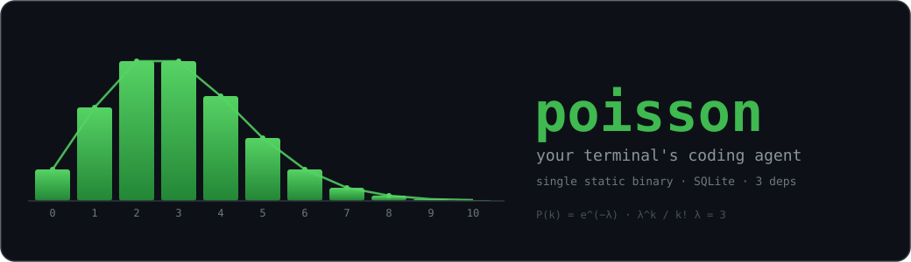

<p align="center">
  
</p>

<p align="center">
  
  
  
  
  
</p>

---

**poisson** is a small, fast coding agent you run in your terminal. It streams a
real conversation, calls tools (bash, file read/write/edit, search, subagents),
tracks every token and dollar, and keeps your whole history in a local SQLite
database you own. No cloud account for the app itself, no telemetry, no
Electron — just one static binary and your terminal.

It talks to **Anthropic** (Claude, via your Pro/Max subscription), **xAI**
(Grok, via SuperGrok) and **Ollama** (local + cloud models). You can paste
images, search past sessions full-text, fork and compact context, and approve
risky shell commands from a popup.

```bash
git clone <this-repo> poisson && cd poisson
./build.sh          # -> ./px  (needs Go 1.25+)
./px login ollama   # or: ./px login anthropic | ./px login xai
./px                # launch the TUI
```

---

## ✨ Features

- **Streaming REPL TUI** — hand-rolled ANSI, no TUI framework. Live thinking
  blocks (Ctrl+T to fold), tool cards you can expand (Ctrl+E), a command palette
  (Ctrl+P), mouse scroll, and a status bar with live context % and exact cost.
- **Real tools** — `bash`, `read`, `write`, `edit`, `ls`, `glob`, `search`,
  `exa_search`, `fetch` (Ollama), plus **subagents** (parallel child agents) and
  **skills**.
- **Bash safety guard** — every shell command is risk-classified; anything
  dangerous pops an approval prompt (you decide, it never auto-allows installs,
  destructive, or `npx`/`dlx` commands).
- **Sessions in SQLite** — every message, tool call, and API call is persisted.
  **Full-text search** (FTS5) across your history, resume any session, fork,
  and auto-compaction that summarizes old turns when context fills up.
- **Exact cost & tokens** — per-API-call token counts and USD cost, live in the
  status bar and via `/cost`.
- **Image input** — paste an image with **Ctrl+V** or attach `@screenshot.png`.
  Images are downscaled to 1024px and sent to vision-capable models. ([details](docs/images.md))
- **Multi-provider** — Anthropic (subscription OAuth), xAI (OAuth), Ollama
  (local daemon or Ollama cloud). Switch model/effort live.
- **Message queueing** — type while the agent is working; your messages are sent
  as one follow-up when the turn ends.

---

## 🚀 Install & run

Requires **Go 1.25+**. Everything else is vendored by the module graph.

```bash
./build.sh            # compiles CGO_ENABLED=0 -> ./px
```

Authenticate a provider (stored in `~/.poisson/auth.json`, mode `0600`):

```bash
./px login anthropic  # Claude Pro/Max — browser OAuth (subscription billing)
./px login xai        # SuperGrok — browser OAuth
./px login ollama     # local Ollama at http://localhost:11434 (no auth needed)
```

Then just:

```bash
./px                  # interactive TUI
./px sessions         # list past sessions
./px cost             # total spend
./px version
```

---

## 🤖 Providers & models

| Provider | Model | Auth | Vision |
|---|---|---|---|
| `anthropic` | `claude-opus-4-8` | OAuth (Pro/Max, stealth) or `api_key` | ✅ |
| `xai` | `grok-build` | OAuth (SuperGrok) | ✅ |
| `ollama` | `glm-5.2:cloud` *(default)* | local daemon / Ollama cloud | ❌ |
| `ollama` | `minimax-m3:cloud` | local daemon / Ollama cloud | ✅ |
| `ollama` | `kimi-k2.7-code:cloud` | local daemon / Ollama cloud | ✅ |

Switch anytime: `/model`, `/effort`, `/providers` (or the Ctrl+P palette).
Reasoning effort levels: `low · medium · high · xhigh · max` (default `medium`;
each model advertises which it supports).

---

## ⚙️ Configuration

Everything lives in **`~/.poisson/`** (created on first run, mode `0700`):

| File | What |
|---|---|
| `~/.poisson/config.toml` | all settings (created with commented defaults on first run) |
| `~/.poisson/auth.json` | OAuth tokens / API keys (mode `0600`) |
| `~/.poisson/poisson.db` | SQLite: sessions, messages, tool/API calls, FTS index |

`config.toml` is written for you with every option commented out — uncomment to
override. The knobs:

```toml
# Reasoning effort for every request (low | medium | high | xhigh | max)
# effort = "medium"

[provider]
# default = "ollama"                 # anthropic | ollama | xai

[anthropic]
# model = "claude-opus-4-8"
# api_key = "sk-ant-..."             # optional; OAuth (auth.json) preferred

[xai]
# model = "grok-build"

[ollama]
# base_url = "http://localhost:11434"
# model = "glm-5.2:cloud"

[compaction]
# threshold = 0.85                   # compact when context passes this fraction
# model = ""                         # summarizer model (default: session model)

[tui]
# theme = "dark"                     # dark | light
# show_tokens = true                 # context % in the status bar
# show_cost = true                   # $ in the status bar

# Pricing per 1M tokens (USD). Subscription/OAuth providers default to 0.
# [pricing.anthropic.claude-opus-4-8]
# input = 5.0
# output = 25.0
```

---

## ⌨️ Keys & commands

Bottom-bar keys (input focus):

```
Enter send · Ctrl+V image · Ctrl+F find · Ctrl+P palette
Ctrl+L effort · Ctrl+T fold thinking · Ctrl+E expand tool · Ctrl+C cancel/clear
```

Slash commands: `/help` `/status` `/model` `/effort` `/providers` `/sessions`
`/resume` `/search` `/new` `/clear` `/name` `/compact` `/cost` `/reload`
`/btw` `/quit`. Type `@` to fuzzy-attach a file (or `@image.png` for an image).

---

## 📦 Dependencies — deliberately tiny

poisson has **3 direct dependencies**. Everything else you see below is a
*transitive* dependency pulled in **only** by those three — never imported by
our code. The rest of the agent is the Go standard library: hand-rolled ANSI
TUI, `net/http` for providers, `encoding/json`, and a hand-written TOML parser.

### Direct (3)

| Dependency | Why it's here |
|---|---|
| **`modernc.org/sqlite`** | Pure-Go SQLite — durable local storage for sessions, messages, the cost ledger, and **FTS5** full-text search. Being pure Go is the whole point: it keeps the build **CGo-free**, so `go build` produces a single static binary with no C toolchain and no external database. |
| **`golang.org/x/term`** | Correct raw-mode terminal handling for the REPL/TUI across platforms. The standard library has no portable equivalent. |
| **`golang.org/x/image`** | Quality image downscaling (CatmullRom resampling) + WebP decoding for pasted/attached images. Stdlib decodes PNG/JPEG/GIF but ships no resampler and no WebP decoder. |

### Transitive (pulled in by the three above, not by us)

| Dependency | Comes from |
|---|---|
| `modernc.org/libc`, `modernc.org/memory`, `modernc.org/mathutil` | `modernc.org/sqlite` (its pure-Go C runtime) |
| `github.com/remyoudompheng/bigfft`, `github.com/ncruces/go-strftime` | `modernc.org/sqlite` |
| `github.com/google/uuid`, `github.com/mattn/go-isatty`, `github.com/dustin/go-humanize` | `modernc.org/sqlite` |
| `golang.org/x/sys` | `golang.org/x/term` |

**What we deliberately *don't* depend on:** no TUI framework, no web framework,
no HTTP client library, no JSON library, no CLI/flags library, no TOML library,
no ORM. Fewer moving parts, faster builds, a smaller attack surface, and a
codebase one person can hold in their head.

> New dependencies are only added when the standard library genuinely can't do
> the job, and are pinned to a release **≥ 14 days old** to dodge fresh-release
> bugs and supply-chain surprises.

---

## 🧭 Design

- **Single static binary** — `CGO_ENABLED=0`, one file, copy it anywhere.
- **Local-first & private** — your data lives in `~/.poisson/poisson.db`. No
  telemetry, no analytics, no phone-home.
- **Suckless-ish** — simplicity over features, delete-before-add, readable code.
- **Tested without the network** — the suite (170+ tests) mocks every provider;
  it never makes a real API call, and runs clean under `-race`.

---

<p align="center"><sub>poisson · run <code>./px</code> · <code>/help</code> for the tour</sub></p>
