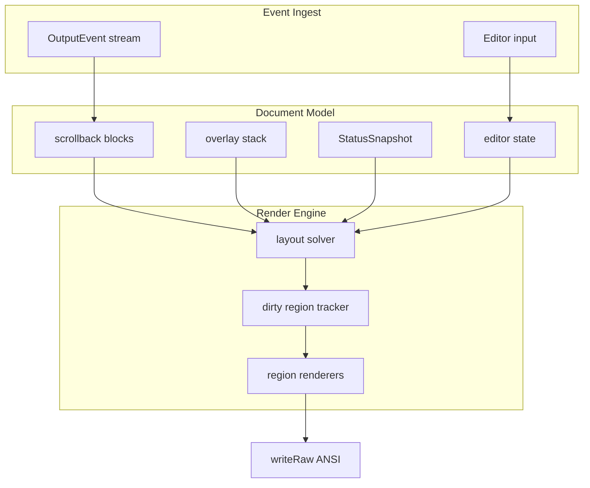

# Poisson TUI UX — Comprehensive Implementation Plan

Agent-oriented plan for bringing the split-screen TUI (`internal/tui/tui.go`)
to parity with — and beyond — modern agent CLIs (Grok Build, Claude Code, Cursor
Agent). Each work package (PR) is sized for a single implementer agent with a
follow-up review pass.

**Baseline (2026-06-26, when this plan started):** alt-screen TUI is the only
REPL, ~6,100 LoC in `internal/tui/`. That count is a historical snapshot, not
a live figure — the package has grown substantially since from unrelated
work; run `wc -l internal/tui/*.go` for the current size rather than trusting
a number in this doc. See `docs/TUI_REDESIGN.md` for the original scaffold spec.

**Status (2026-06-27):**

| Phase | PRs | State |
|-------|-----|-------|
| **A — Smoothness** | PR-01 … PR-04 | ✅ Done (dirty incremental + polish) |
| **B — Rich content** | PR-05 … PR-09 | ✅ Done (block, md, highlight, thinking, cards) |
| **C — Interactive UX** | PR-10 … PR-14 | ✅ Done (v2 pickers, fuzzy, palette) |
| **C+ — Grok parity** | PR-21–23 | ✅ Done (header, input chrome, /btw; visual polish complete) |
| **D — Power features** | PR-15 … PR-20 | ✅ Done (mouse, expand, search, yank, wrap, theme) |
| **E — Trust polish** | PR-24 | ✅ Done (approval command explanations) |

Post-phase hardening verified: Kitty keys, row-scroll, completion, cols-1 paint,
GFM tables, /tmp isolation in tests. All PRs complete.

**North star:** Grok Build CLI — clean chat column, bordered tables, token/status header,
bottom input with mode hints, floating side Q&A without blocking the main agent (`/btw`).

---

## 1. Goals

| Goal | Success metric |
|------|----------------|
| **Smooth** | No visible flicker during streaming; ≤1 full repaint/sec when idle |
| **Readable** | Markdown, code blocks, structured tool cards — not raw plain text |
| **Fast to operate** | Pick model/provider/session without memorizing slash syntax |
| **Trustworthy** | Approval prompts are unmissable; every gated command shows a one-line purpose; status bar is always accurate |
| **Testable** | Pure-function coverage for every renderer; no brittle TTY integration tests |

---

## 2. Design Constraints (non-negotiable)

From `docs/SPEC.md` §1 and project conventions:

1. **Pure ANSI** — no ncurses, bubbletea, tview, lipgloss, or full-screen frameworks.
2. **Minimal deps** — stay on stdlib + `golang.org/x/term`. New deps require explicit
   justification in the PR (prefer in-tree parsers).
3. **Single stdin reader** — the input goroutine owns stdin; approval routes through
   `approvalAnswer` channel (already in v2).
4. **Serialized terminal writes** — all output through `t.writeRaw()` / render goroutine.
5. **Single TUI** — only the alt-screen REPL ships; no readline fallback.
6. **No commit until user says so** — agents stage changes; orchestrator commits.

---

## 3. Current Baseline (v2 — what exists)

### Layout (alt-screen)

```
┌─ header (cwd · tokens/window · model · time) ───────────┐
├─ scrollback (blocks, markdown, tool cards) ─────────────┤
│  user / assistant / thinking / tool / system / error   │
├─ input ─────────────────────────────────────────────────┤
│  ─────────────────────────────────────────────────────  │
│  › multi-line editor (wrap, vertical scroll)            │
│  Enter:send · Ctrl+V:image · Ctrl+F:find · Ctrl+P:palette … │
└────────────────────────────────────────────────────────┘
```

### Implemented features

| Feature | File(s) | Notes |
|---------|---------|-------|
| Alt-screen lifecycle | `tui.go`, `palette.go` | `?1049h`, kitty keyboard, bracketed paste |
| Scrollback ring buffer | `scrollback.go` | Streaming merge for assistant/thinking |
| Multi-line editor | `input.go` | Kitty Enter/Shift+Enter, paste, history |
| Tab completion | `complete.go` | Prefix match `/commands` + `@files`; dropdown overlay |
| Status snapshot | `status.go` | 2-row bar; static spinner char when `Thinking` |
| Slash commands | `commands.go` | Shared via `commandHost` |
| Approval flow | `tui.go:Approve`, `overlay_approval.go` | Floating modal; blocks on `approvalAnswer` channel |
| Tool previews | `render.go` | `toolInputPreview`, `toolResultPreview` |
| SIGWINCH resize | `tui.go` | Full re-layout + dirty flag |

### Known pain points (ranked by user impact)

| # | Gap | Impact | Status |
|---|-----|--------|--------|
| 1 | Screen flicker during streaming | 10 | ✅ PR-01 dirty render |
| 2 | Plain text assistant output | 9 | ✅ PR-06 markdown (+ tables) |
| 3 | `/model` `/providers` text-only | 9 | ✅ PR-11/12 pickers (v2) |
| 4 | Thinking streams as dim plain text | 8 | ✅ PR-08 collapse |
| 5 | Tool calls are one-liner previews | 8 | ✅ PR-09 tool cards |
| 6 | Tab completion prefix-only, on Tab | 8 | ✅ PR-10 live fuzzy |
| 7 | Static spinner | 7 | ✅ PR-02 animated |
| 8 | Approval buried in scrollback | 7 | ✅ PR-03 modal |
| 9 | No syntax highlighting in fences | 7 | ✅ PR-07 highlight |
| 10 | Mouse unsupported | 6 | ✅ wheel + click (PR-15) |
| 11 | No command palette | 6 | ✅ PR-14 Ctrl+P (v2) |
| 12 | `/sessions` is text list | 6 | ✅ PR-13 picker (v2) |
| 13 | Tool results truncated | 5 | ✅ PR-16 Ctrl+E expand (v2) |
| 14 | No scrollback search | 5 | ✅ PR-17 Ctrl+F (v2) |
| 15 | No OSC 52 copy | 5 | ✅ PR-18 Ctrl+Y yank |
| 16 | Status bar missing tool counters | 5 | ✅ PR-04 |
| 17 | No word-wrap scrollback | 4 | ✅ PR-19 done |
| 18 | Completion shows all candidates | 4 | ✅ PR-10 cap/rank |
| 19 | No true-color detection | 3 | ✅ PR-20 done |
| 20 | Approval shows command only, no purpose line | 6 | ✅ PR-24 |

---

## 4. Target Architecture

Evolve from **flat styled lines** → **document blocks** → **region-aware renderer**.



### New core types (introduced in PR-05, extended by later PRs)

```go
// block.go — logical document unit (replaces flat StyledLine for rich content)
type BlockKind uint8
const (
  blockUser BlockKind = iota
  blockAssistant
  blockThinking      // collapsible
  blockToolCall      // card: header + body + status
  blockToolResult
  blockCode          // fenced code + lang
  blockSystem
  blockError
  blockCompacting
)

type Block struct {
  ID        int64      // monotonic
  Kind      BlockKind
  Raw       string     // source text (markdown for assistant)
  Rendered  []ScreenRow // cached ANSI rows at last width
  Meta      BlockMeta  // tool name, collapsed, exit code, etc.
  Dirty     bool       // needs re-layout
}

type ScreenRow struct {
  Text string // includes inline ANSI
  Tags rowTag // for incremental diff
}

// overlay.go — modal layers above scrollback
type Overlay interface {
  Kind() string
  Rows(width int) []string // ANSI rows
  HandleKey([]byte) (done bool, redraw bool)
}
```

### Render engine (introduced in PR-01, refactored in PR-05)

```go
type renderPlan struct {
  scrollRegion  rect
  inputRegion   rect
  statusRegion  rect
  overlayRegion *rect // nil if no overlay
}

type dirtyTracker struct {
  scroll  bitmap // or row-set
  input   bool
  status  bool
  overlay bool
  full    bool   // resize, first paint
}
```

**Rule:** streaming updates mark only the last scroll row (+ status if changed).
Resize marks `full`.

---

## 5. Phase DAG

```
Phase A — Smoothness ✅
  PR-01 incremental render ──┬──► PR-02 animated indicators ✅
                             └──► PR-03 approval modal ✅
                                      │
Phase B — Rich content ✅    PR-04 status polish ✅
  PR-05 block model ◄───────────────┘
       │
       ├──► PR-06 markdown inline ✅ (+ GFM tables)
       ├──► PR-07 code blocks + highlight ✅
       ├──► PR-08 collapsible thinking ✅
       └──► PR-09 tool call cards ✅

Phase C — Interactive UX ✅
  PR-10 live fuzzy autocomplete ✅
  PR-11 model picker ✅
  PR-12 provider picker ✅
  PR-13 session picker ✅
  PR-14 command palette ✅

Phase C+ — Grok Build parity ✅
  PR-21 /btw side-steer overlay ✅
  PR-22 top header strip (cwd · tokens · time) ✅
  PR-23 input chrome (› prompt, Grok hints, Ctrl+.) ✅

Phase D — Power features ✅
  PR-16 expandable tool results ✅
  PR-17 scrollback search ✅
  PR-15 mouse support (wheel + clicks) ✅
  PR-18 OSC 52 copy / yank ✅
  PR-19 word-wrap scrollback ✅
  PR-20 true-color + theme config ✅
```

**Parallelism:** Within a phase, independent PRs can run in parallel in isolated
worktrees (`cruc run -d ./poisson -- …`). Cross-phase deps are strict.

**Recommended execution order:** A1 → A2,A3,A4 (parallel) → B5 → B6,B7,B8,B9
(parallel where noted) → C10–C14 → D15–D20.

---

## 6. Work Packages (PR Specs) — archived

All 24 PRs (Phases A–E) shipped. The full specs (deps/files/steps/acceptance/
tests/agent-prompt per PR) are archived verbatim at
`docs/archive/TUI_UX_PLAN_2026-06_PR_SPECS.md` — historical record, not a live
reference. If more TUI work gets planned, start a new dated plan file rather
than reopening this one.

---

## 7. Agent Orchestration Guide

### Spawning implementers

Use isolated sandboxes for parallel PRs:

```bash
# Example: PR-01 in cruc
cruc run -d /home/mq/workdir/poisson -- \
  pi -p "Implement PR-01 from docs/TUI_UX_PLAN.md. Read the plan first.
  Run go test ./internal/tui/... -race before finishing. Do not git commit."

# Parallel PRs only if deps satisfied:
# PR-02, PR-03, PR-04 can run after PR-01 merges
```

### Review checklist (every PR)

1. `go test ./... -race` passes.
2. `go vet ./...` clean.
3. No new deps without plan update.
4. Alt-screen TUI compiles and runs.
5. Manual smoke (§8) for UX PRs.
6. Diff scoped to PR files — no drive-by refactors.

### Suggested Graphite / branch stack

```
main
 └── tui-ux/A-incremental-render      (PR-01)
      ├── tui-ux/A-spinner            (PR-02)
      ├── tui-ux/A-approval-modal     (PR-03)
      └── tui-ux/A-status-polish      (PR-04)
 └── tui-ux/B-block-model             (PR-05)
      ├── tui-ux/B-markdown           (PR-06)
      ├── tui-ux/B-code-highlight     (PR-07)
      ├── tui-ux/B-thinking-collapse  (PR-08)
      └── tui-ux/B-tool-cards         (PR-09)
 └── tui-ux/C-fuzzy-complete          (PR-10)
      ├── tui-ux/C-model-picker       (PR-11)
      ├── …
```

Land Phase A before Phase B. Phase C pickers can start after PR-03 + PR-10.

---

## 8. Manual Smoke Checklist

Run after each phase merge:

```bash
cd /home/mq/workdir/poisson
go build -o ./px .
script -q -c './px' /tmp/px-smoke.txt   # exit with /quit
./px                                    # alt-screen REPL
```

| Check | How |
|-------|-----|
| Alt-screen enters/exits cleanly | shell prompt restored, no stray ANSI |
| Submit prompt | user bar + streaming assistant |
| Tool call | card appears, completes |
| Ctrl+C cancel | hint shown, second Ctrl+C exits |
| Resize terminal | layout reflows |
| Tab completion | `/hel` → `/help` |
| @file expand | `@README.md` in prompt inlines |
| Approval | `rm -rf` test in guard triggers modal with `Purpose:` line |
| `/model` picker | (Phase C) switch ollama model |
| Mouse wheel | (Phase D) scroll history |

---

## 9. Testing Strategy

| Layer | What to test | Where |
|-------|--------------|-------|
| Pure formatters | markdown, highlight, fuzzy, spinner, theme | `*_test.go` table-driven |
| Layout | block merge, wrap, visible viewport | `block_test.go`, `scrollback_test.go` |
| Overlays | key routing, picker navigation | `overlay_*_test.go` |
| Dirty render | row set logic | `dirty_test.go` |
| Integration | **avoid** full TTY — use `bytes.Buffer` + inject `t.writer` | selective `tui_test.go` |

**Do not** add tests that require a real terminal unless using build tags.

---

## 10. Out of Scope (v3+)

- Kitty / iTerm graphics protocol images
- Vertical split panes (editor left, output right)
- Embedded file tree / git diff tabs (see `foundry/` / `erebor/` for that UX)
- Bubbletea / tview migration
- Persistent TUI preferences in SQLite
- Rich diff rendering for `edit` tool (unified diff with colors) — nice-to-have later

---

## 11. Risk Register

| Risk | Mitigation |
|------|------------|
| Markdown parser bugs / ANSI leaks | Fuzz tests; always `reset` per span; gold tests |
| Incremental render desync | `rowTag` per ScreenRow; full repaint on resize |
| Overlay + streaming race | `approvalMu` pattern extended to `overlayMu` |
| Mouse on SSH without forwarding | Detect + degrade gracefully |
| Scope creep | One PR = one section here; reviewer enforces |

---

## 12. Effort Summary

| Phase | PRs | Est. hours | Status |
|-------|-----|------------|--------|
| A — Smoothness | 01–04 | 17–22 | ✅ Done |
| B — Rich content | 05–09 | 39–48 | ✅ Done |
| C — Interactive | 10–14 | 26–33 | ✅ Done |
| C+ — Grok parity | 21–23 | 9–13 | ✅ Done (incl. visual polish) |
| D — Power | 15–20 | 28–35 | ✅ Done |
| E — Trust polish | 24 | 2–3 | ✅ Done |
| **Total** | **24** | **~125–160** | **100% complete** |

Parallelizing Phase A (after PR-01) and Phase B (after PR-05) can wall-clock
compress to ~4–6 focused days with 3–4 agents.

---

## 13. Keybindings Reference (current, verified against `key_dispatch.go`)

| Key | Action |
|-----|--------|
| Enter | Submit (kitty plain Enter) |
| Tab | Completion cycle / accept |
| Ctrl+Space | Open completion |
| Ctrl+V | Paste clipboard image |
| Ctrl+F | Scrollback search |
| Ctrl+P | Command palette |
| Ctrl+L | Effort picker |
| Ctrl+T | Toggle thinking collapse |
| Ctrl+E | Expand/collapse focused tool result |
| Ctrl+Y | Copy the mouse-drag text selection (OSC 52) |
| Ctrl+M | Model picker |
| Ctrl+S | Session picker |
| Ctrl+B | Open `/btw` side-question prompt |
| Ctrl+G | Finish/expedite running subagents now |
| Ctrl+R / Ctrl+N | Input history prev/next |
| Shift+Tab | Toggle fast/paranoid approval mode |
| Esc | Cancel running turn / close overlay |
| Ctrl+C | Clear input (twice to exit) |
| PgUp/PgDn | Scroll history |
| Mouse wheel | Scroll history |
| `a`/`d` | Allow/deny approval |

This table is the source of truth for `README.md`'s "Keys & commands" section
— keep both in sync when a binding changes. Also documented in `/help`.

---

## 14. File Map (which PR introduced what — historical, not exhaustive)

`internal/tui/` has grown to well over 100 files since this plan started
(`wc -l internal/tui/*.go` for the current count) — this list only traces
which PR introduced each file below, it is not a map of the package today.

```
internal/tui/
  block.go              PR-05
  clipboard.go          PR-18
  complete.go           (existing, PR-10)
  dirty.go              PR-01
  fuzzy.go              PR-10
  markdown_table.go     PR-06 ext
  overlay_picker.go     PR-11–13
  overlay_palette.go    PR-14
  overlay_v2.go         PR-11–14, PR-21 wiring
  overlay_btw.go        PR-21 /btw
  overlay_search.go     PR-17
  quickanswer.go        PR-21 (agent/)
  highlight.go          PR-07
  markdown.go           PR-06
  mouse.go              PR-15
  overlay.go            PR-03
  overlay_approval.go   PR-03
  spinner.go            PR-02
  theme.go              PR-20
  thinking.go           PR-08
  toolcard.go           PR-09
```

---

*Plan closed: all 24 PRs shipped (2026-06-27). Baseline at plan start:
v2 TUI @ ~6091 LoC — a historical snapshot only, see §3. Full PR specs
archived to `docs/archive/TUI_UX_PLAN_2026-06_PR_SPECS.md`. Start a new dated
plan file for future TUI work rather than reopening this one.*