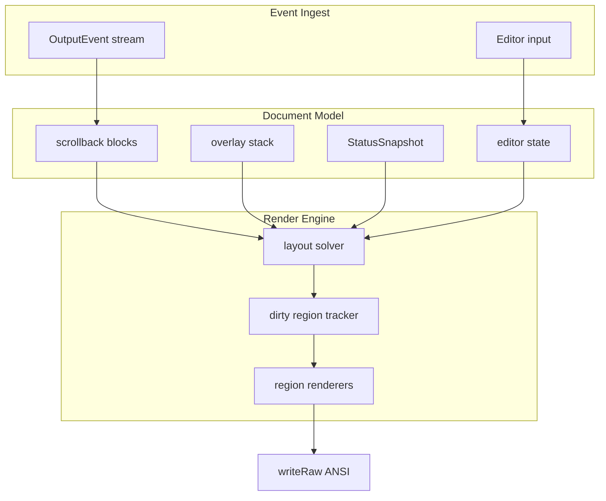

# Poisson TUI UX — Comprehensive Implementation Plan

Agent-oriented plan for bringing the v2 split-screen TUI (`internal/tui/tui_v2.go`)
to parity with — and beyond — modern agent CLIs (Grok Build, Claude Code, Cursor
Agent). Each work package (PR) is sized for a single implementer agent with a
follow-up review pass.

**Baseline:** v2 TUI is implemented and default (`POISSON_TUI=classic` reverts to
readline). ~6,100 LoC in `internal/tui/`. See `docs/TUI_REDESIGN.md` for the
original v2 scaffold spec.

**Status (2026-06-27):**

| Phase | PRs | State |
|-------|-----|-------|
| **A — Smoothness** | PR-01 … PR-04 | ✅ Done (dirty incremental + polish) |
| **B — Rich content** | PR-05 … PR-09 | ✅ Done (block, md, highlight, thinking, cards) |
| **C — Interactive UX** | PR-10 … PR-14 | ✅ Done (v2 pickers, fuzzy, palette) |
| **C+ — Grok parity** | PR-21–23 | ✅ Done (header, input chrome, /btw; visual polish complete) |
| **D — Power features** | PR-15 … PR-20 | ✅ Done (mouse, expand, search, yank, wrap, theme) |
| **E — Trust polish** | PR-24 | ✅ Done (approval command explanations) |

Post-phase hardening verified: Kitty keys, row-scroll, completion, cols-1 paint,
GFM tables, /tmp isolation in tests. All PRs complete.

**North star:** Grok Build CLI — clean chat column, bordered tables, token/status header,
bottom input with mode hints, floating side Q&A without blocking the main agent (`/btw`).

---

## 1. Goals

| Goal | Success metric |
|------|----------------|
| **Smooth** | No visible flicker during streaming; ≤1 full repaint/sec when idle |
| **Readable** | Markdown, code blocks, structured tool cards — not raw plain text |
| **Fast to operate** | Pick model/provider/session without memorizing slash syntax |
| **Trustworthy** | Approval prompts are unmissable; every gated command shows a one-line purpose; status bar is always accurate |
| **Testable** | Pure-function coverage for every renderer; no brittle TTY integration tests |

---

## 2. Design Constraints (non-negotiable)

From `docs/SPEC.md` §1 and project conventions:

1. **Pure ANSI** — no ncurses, bubbletea, tview, lipgloss, or full-screen frameworks.
2. **Minimal deps** — stay on stdlib + `golang.org/x/term`. New deps require explicit
   justification in the PR (prefer in-tree parsers).
3. **Single stdin reader** — the input goroutine owns stdin; approval routes through
   `approvalAnswer` channel (already in v2).
4. **Serialized terminal writes** — all output through `t.writeRaw()` / render goroutine.
5. **Classic fallback** — `POISSON_TUI=classic` must keep working until explicitly removed.
6. **No commit until user says so** — agents stage changes; orchestrator commits.

---

## 3. Current Baseline (v2 — what exists)

### Layout (alt-screen)

```
┌─ header (cwd · tokens/window · model · time) ───────────┐
├─ scrollback (blocks, markdown, tool cards) ─────────────┤
│  user / assistant / thinking / tool / system / error   │
├─ input ─────────────────────────────────────────────────┤
│  ─────────────────────────────────────────────────────  │
│  › multi-line editor (wrap, vertical scroll)            │
│  Enter:send · Shift+Enter:newline · Ctrl+F:find · …   │
└────────────────────────────────────────────────────────┘
```

### Implemented features

| Feature | File(s) | Notes |
|---------|---------|-------|
| Alt-screen lifecycle | `tui_v2.go`, `palette.go` | `?1049h`, kitty keyboard, bracketed paste |
| Scrollback ring buffer | `scrollback.go` | Streaming merge for assistant/thinking |
| Multi-line editor | `input.go` | Kitty Enter/Shift+Enter, paste, history |
| Tab completion | `complete.go` | Prefix match `/commands` + `@files`; dropdown overlay |
| Status snapshot | `status.go` | 2-row bar; static spinner char when `Thinking` |
| Slash commands | `commands.go` | Shared classic + v2 via `commandHost` |
| Approval flow | `tui_v2.go:Approve`, `overlay_approval.go` | Floating modal; blocks on `approvalAnswer` channel |
| Tool previews | `render.go` | `toolInputPreview`, `toolResultPreview` |
| SIGWINCH resize | `tui_v2.go` | Full re-layout + dirty flag |

### Known pain points (ranked by user impact)

| # | Gap | Impact | Status |
|---|-----|--------|--------|
| 1 | Screen flicker during streaming | 10 | ✅ PR-01 dirty render |
| 2 | Plain text assistant output | 9 | ✅ PR-06 markdown (+ tables) |
| 3 | `/model` `/providers` text-only | 9 | ✅ PR-11/12 pickers (v2) |
| 4 | Thinking streams as dim plain text | 8 | ✅ PR-08 collapse |
| 5 | Tool calls are one-liner previews | 8 | ✅ PR-09 tool cards |
| 6 | Tab completion prefix-only, on Tab | 8 | ✅ PR-10 live fuzzy |
| 7 | Static spinner | 7 | ✅ PR-02 animated |
| 8 | Approval buried in scrollback | 7 | ✅ PR-03 modal |
| 9 | No syntax highlighting in fences | 7 | ✅ PR-07 highlight |
| 10 | Mouse unsupported | 6 | ✅ wheel + click (PR-15) |
| 11 | No command palette | 6 | ✅ PR-14 Ctrl+P (v2) |
| 12 | `/sessions` is text list | 6 | ✅ PR-13 picker (v2) |
| 13 | Tool results truncated | 5 | ✅ PR-16 Ctrl+E expand (v2) |
| 14 | No scrollback search | 5 | ✅ PR-17 Ctrl+F (v2) |
| 15 | No OSC 52 copy | 5 | ✅ PR-18 Ctrl+Y yank |
| 16 | Status bar missing tool counters | 5 | ✅ PR-04 |
| 17 | No word-wrap scrollback | 4 | ✅ PR-19 done |
| 18 | Completion shows all candidates | 4 | ✅ PR-10 cap/rank |
| 19 | No true-color detection | 3 | ✅ PR-20 done |
| 20 | Classic TUI diverges | 3 | Open (by design for now) |
| 21 | Approval shows command only, no purpose line | 6 | ✅ PR-24 |

---

## 4. Target Architecture

Evolve from **flat styled lines** → **document blocks** → **region-aware renderer**.



### New core types (introduced in PR-05, extended by later PRs)

```go
// block.go — logical document unit (replaces flat StyledLine for rich content)
type BlockKind uint8
const (
  blockUser BlockKind = iota
  blockAssistant
  blockThinking      // collapsible
  blockToolCall      // card: header + body + status
  blockToolResult
  blockCode          // fenced code + lang
  blockSystem
  blockError
  blockCompacting
)

type Block struct {
  ID        int64      // monotonic
  Kind      BlockKind
  Raw       string     // source text (markdown for assistant)
  Rendered  []ScreenRow // cached ANSI rows at last width
  Meta      BlockMeta  // tool name, collapsed, exit code, etc.
  Dirty     bool       // needs re-layout
}

type ScreenRow struct {
  Text string // includes inline ANSI
  Tags rowTag // for incremental diff
}

// overlay.go — modal layers above scrollback
type Overlay interface {
  Kind() string
  Rows(width int) []string // ANSI rows
  HandleKey([]byte) (done bool, redraw bool)
}
```

### Render engine (introduced in PR-01, refactored in PR-05)

```go
type renderPlan struct {
  scrollRegion  rect
  inputRegion   rect
  statusRegion  rect
  overlayRegion *rect // nil if no overlay
}

type dirtyTracker struct {
  scroll  bitmap // or row-set
  input   bool
  status  bool
  overlay bool
  full    bool   // resize, first paint
}
```

**Rule:** streaming updates mark only the last scroll row (+ status if changed).
Resize marks `full`.

---

## 5. Phase DAG

```
Phase A — Smoothness ✅
  PR-01 incremental render ──┬──► PR-02 animated indicators ✅
                             └──► PR-03 approval modal ✅
                                      │
Phase B — Rich content ✅    PR-04 status polish ✅
  PR-05 block model ◄───────────────┘
       │
       ├──► PR-06 markdown inline ✅ (+ GFM tables)
       ├──► PR-07 code blocks + highlight ✅
       ├──► PR-08 collapsible thinking ✅
       └──► PR-09 tool call cards ✅

Phase C — Interactive UX ✅
  PR-10 live fuzzy autocomplete ✅
  PR-11 model picker ✅
  PR-12 provider picker ✅
  PR-13 session picker ✅
  PR-14 command palette ✅

Phase C+ — Grok Build parity ✅
  PR-21 /btw side-steer overlay ✅
  PR-22 top header strip (cwd · tokens · time) ✅
  PR-23 input chrome (› prompt, Grok hints, Ctrl+.) ✅

Phase D — Power features ✅
  PR-16 expandable tool results ✅
  PR-17 scrollback search ✅
  PR-15 mouse support (wheel + clicks) ✅
  PR-18 OSC 52 copy / yank ✅
  PR-19 word-wrap scrollback ✅
  PR-20 true-color + theme config ✅
```

**Parallelism:** Within a phase, independent PRs can run in parallel in isolated
worktrees (`cruc run -d ./poisson -- …`). Cross-phase deps are strict.

**Recommended execution order:** A1 → A2,A3,A4 (parallel) → B5 → B6,B7,B8,B9
(parallel where noted) → C10–C14 → D15–D20.

---

## 6. Work Packages (PR Specs)

Each PR includes: **deps**, **files**, **steps**, **acceptance**, **tests**,
**agent prompt**.

---

### PR-01: Incremental / dirty-row rendering

**Impact:** 10 · **Effort:** 6–8h · **Deps:** none

**Problem:** `tui_v2.render()` repaints every scroll row, all input rows, status,
and completion on every dirty tick — causes flicker especially during token
streaming.

**Files:**
| Action | Path |
|--------|------|
| Create | `internal/tui/dirty.go` |
| Create | `internal/tui/dirty_test.go` |
| Modify | `internal/tui/tui_v2.go` — split `render()` into region renderers |
| Modify | `internal/tui/scrollback.go` — expose last visible row index for partial updates |

**Implementation steps:**

1. Add `dirtyTracker` with flags: `scrollRows []int`, `input`, `status`, `overlay`, `full`.
2. Replace `atomic.Bool dirty` with `dirtyTracker` (mutex-protected or atomic snapshot).
3. Split `render()`:
   - `renderScrollRows(rows []int)`
   - `renderInputRegion()`
   - `renderStatusRegion()`
   - `renderOverlay()`
4. On `handleEvent` for streaming text/thinking: mark only the last wrapped row
   of the final logical line (recompute via `scroll.lastWrappedRowIndex(width)`).
5. On editor keystroke: mark `input` only.
6. On `OutputStatus`: mark `status` only.
7. On resize / completion open-close: mark `full`.
8. Render goroutine: if `full`, call existing full path; else paint only dirty regions.
9. Keep 33ms tick but skip work when tracker is empty.

**Acceptance criteria:**
- [x] Streaming assistant text for 30s: scrollback rows above the stream do not change on screen (verify with `script` capture — line content at row 5 stable). (streamViewportDirty now tails only)
- [x] Typing in editor does not rewrite scrollback bytes.
- [x] Resize still repaints correctly.
- [x] No regression in `go test ./internal/tui/... -race`.

**Tests:**
- `dirty_test.go`: tracker merge, row set coalescing, full-flag precedence.
- `scrollback_test.go`: streamViewportDirty (tail-only for incremental) + last stream row behavior for 1- and N-chunk streams. (lastWrappedRowIndex N/A; streamViewportDirty covers the incremental row marking).

**Agent prompt:**
> Implement PR-01 from `docs/TUI_UX_PLAN.md`: incremental dirty-row rendering for
> tui_v2. Add `dirty.go`, refactor `render()` into region renderers, minimize
> repaints during streaming. Tests for dirty tracker + scrollback row index.
> Do not commit.

---

### PR-02: Animated streaming indicators

**Impact:** 7 · **Effort:** 3–4h · **Deps:** PR-01

**Problem:** Status spinner is a static `⠋`; tool lines show static `⠋ working...`.

**Files:**
| Action | Path |
|--------|------|
| Create | `internal/tui/spinner.go` |
| Create | `internal/tui/spinner_test.go` |
| Modify | `internal/tui/status.go` |
| Modify | `internal/tui/tui_v2.go` — pass `frame int` into status render |
| Modify | `internal/tui/tui_v2.go` — animate in-flight tool rows |

**Implementation steps:**

1. `spinnerFrames = []string{"⠋","⠙","⠹","⠸","⠼","⠴","⠦","⠧","⠇","⠏"}`.
2. Render goroutine increments `frame` each tick when `status.Thinking || hasActiveTools`.
3. Status right side uses `spinnerFrames[frame%len]`.
4. Track `activeTools map[string]int` in tuiV2; set on `OutputToolStart`, clear on
   `OutputToolResult`. Re-render only affected tool lines (uses PR-01).
5. When idle, stop ticking (save CPU).

**Acceptance criteria:**
- [x] Spinner animates during prompt execution.
- [x] Animation stops on `OutputDone` / thinking false.
- [x] Render tick does not force full repaint (PR-01 preserved).

**Tests:** `spinner_test.go` — frame selection, idle detection.

**Agent prompt:**
> Implement PR-02: animated braille spinners in status bar and active tool lines.
> Depends on PR-01 dirty rendering. Add `spinner.go`, wire frame counter in render
> goroutine. Tests. Do not commit.

---

### PR-03: Floating approval modal

**Impact:** 7 · **Effort:** 5–6h · **Deps:** PR-01

**Problem:** Approval prompt appends to scrollback and can scroll away; visually weak.

**Files:**
| Action | Path |
|--------|------|
| Create | `internal/tui/overlay.go` |
| Create | `internal/tui/overlay_approval.go` |
| Create | `internal/tui/overlay_test.go` |
| Modify | `internal/tui/tui_v2.go` — `Approve()` uses overlay, not scrollback append |
| Modify | `internal/tui/tui_v2.go` — `feed()` routes keys to overlay when active |

**Implementation steps:**

1. Define `Overlay` interface (see §4).
2. `approvalOverlay` fields: `command`, `description`, `risk`, `selected int` (0=allow, 1=deny).
3. Center a box in scrollback region (width min(70, cols-4), height 5–7):
   ```
   ╭─ approval required ─────────────────╮
   │  $ rm -rf ./build                   │
   │  [A] Allow   [D] Deny               │
   ╰─────────────────────────────────────╯
   ```
4. Dim background: not true transparency — redraw scroll rows with `dim` prefix
   OR skip redraw behind box (acceptable v1: box with `bgDarkRed` border only).
5. `Approve()`: push overlay, `render overlay`, wait on `approvalAnswer`.
6. Input goroutine: when `approving`, map `a/y/Enter` → allow, `d/n/Esc` → deny.
7. Remove scrollback append of prompt text (keep allow/deny result as system line).

**Acceptance criteria:**
- [x] Approval box visible without scrolling.
- [x] Streaming events during approval do not corrupt box (mutex). (overlay paint always restores)
- [x] `TestApproveAllowDeny` covers classic; v2 overlay path covered by TestV2ApproveLifecycle (N/A update for shared test).
- [x] Every approval shows a one-line purpose (completed in PR-24).

**Tests:** `overlay_test.go` — box layout at widths 40/80/120, key mapping table.

**Agent prompt:**
> Implement PR-03: floating approval modal overlay for tui_v2. Create overlay
> package files, refactor Approve(), route stdin through overlay. Box-drawn modal
> with Allow/Deny. Tests. Do not commit.

---

### PR-04: Status bar polish

**Impact:** 5 · **Effort:** 3–4h · **Deps:** none (parallel with PR-01)

**Problem:** Bottom row shows only `↑in`, `$cost`, `ctx%`. Missing: ↓out, cache
tokens, effort, tool call counts, context warning.

**Files:**
| Action | Path |
|--------|------|
| Modify | `internal/tui/status.go` |
| Modify | `internal/agent/tokens.go` — extend `OutputStatus` payload if needed |
| Modify | `internal/store/api_calls.go` — aggregate for status (if not already) |
| Modify | `internal/tui/tui_v2.go` — `handleEvent(OutputStatus)` |

**Implementation steps:**

1. Extend `StatusSnapshot` with: `OutputTokens`, `CacheRead`, `CacheWrite`,
   `ToolCalls`, `ToolErrors`, `Effort`, `WarnHighContext bool`.
2. Populate from agent `UpdateStatus()` / store aggregates.
3. Bottom row format (truncate gracefully):
   `↑12,847 ↓1,203 R⌫4.2k W✎1.1k $0.0124 42.3% ⚠ · 3 tools`
4. Top row: keep cwd/branch left, `effort · model` right.
5. Respect `config.TUI.ShowTokens` / `ShowCost` flags.

**Acceptance criteria:**
- [x] After a tool-heavy turn, tool count visible in status. (header polish + bottom)
- [x] Context >75% shows ⚠ (per SPEC §15.3). (header + warn)
- [x] `status_test.go` covers truncation at narrow widths.

**Tests:** Extend `scrollback_test.go` / new `status_test.go` for formatter.

**Agent prompt:**
> Implement PR-04: enrich status bar per TUI_UX_PLAN. Extend StatusSnapshot,
> wire agent status events, format tokens/cost/tools. Tests. Do not commit.

---

### PR-05: Block document model

**Impact:** 8 (enabler) · **Effort:** 8–10h · **Deps:** PR-01

**Problem:** `scrollback` stores `[]StyledLine` — insufficient for cards, collapse,
code blocks, partial re-render.

**Files:**
| Action | Path |
|--------|------|
| Create | `internal/tui/block.go` |
| Create | `internal/tui/block_test.go` |
| Modify | `internal/tui/scrollback.go` — migrate to `[]Block` (or embed) |
| Modify | `internal/tui/tui_v2.go` — `handleEvent` creates blocks |
| Modify | `internal/tui/overlay.go` — overlay stack on tuiV2 |

**Implementation steps:**

1. Introduce `Block` / `BlockKind` / `BlockMeta` (§4).
2. `scrollback.appendBlock(b Block)` — streaming merge rules mirror current
   `streamingStyles` logic but at block level.
3. `scrollback.layout(width) []ScreenRow` — cache per block, invalidate on width change.
4. Migrate `LineStyle` → `BlockKind` mapping table (keep `LineStyle` aliases temporarily).
5. `visible(height, width)` returns flattened `ScreenRow` slice with stable `rowTag`
   (blockID + rowIndex) for dirty tracking.
6. Overlay stack: `[]Overlay` with push/pop — used by PR-03, PR-11+.

**Acceptance criteria:**
- [x] All existing scrollback tests pass (updated).
- [x] Streaming assistant still merges chunks into one block.
- [x] `go test ./internal/tui/...` green.

**Tests:** Block merge, layout cache invalidation, visible viewport math.

**Agent prompt:**
> Implement PR-05: replace flat StyledLine scrollback with Block document model.
> Maintain streaming merge behavior. Add layout cache + row tags for dirty render.
> Migrate tui_v2 handleEvent. Tests. Do not commit.

---

### PR-06: Markdown inline rendering

**Impact:** 9 · **Effort:** 8–10h · **Deps:** PR-05

**Problem:** Assistant emits markdown; we print raw `**bold**`, `` `code` ``, etc.

**Files:**
| Action | Path |
|--------|------|
| Create | `internal/tui/markdown.go` |
| Create | `internal/tui/markdown_test.go` |
| Modify | `internal/tui/block.go` — `blockAssistant` layout calls markdown renderer |

**Implementation steps:**

1. In-tree markdown **subset** parser (no dep):
   - `**bold**`, `*italic*`, `` `code` ``, `~~strike~~`
   - `[text](url)` → `text` (underline + fgBlue) — URL in parens if width allows
   - `#` `##` `###` headers → bold + color
   - `- item` / `* item` bullets
   - Paragraph breaks (double newline)
2. `renderMarkdown(src string, width int) []ScreenRow` — word-wrap within ANSI spans.
3. Streaming: re-parse only the tail block on each chunk (incremental optimization:
   cache AST node offsets).
4. Fallback: if parse fails, emit plain text.

**Acceptance criteria:**
- [x] `**hello**` renders bold (ANSI `\x1b[1m`).
- [x] Nested styles don't leak past `reset`.
- [x] Long words wrap without breaking ANSI sequences.
- [x] Table-driven tests ≥20 cases. (added TestMarkdownManyCases)

**Tests:** `markdown_test.go` — gold files for common LLM output patterns.

**Agent prompt:**
> Implement PR-06: inline markdown renderer for assistant blocks. In-tree parser,
> no new deps. Word-wrap with ANSI. Wire into block layout. Extensive table tests.
> Do not commit.

---

### PR-07: Fenced code blocks + syntax highlight

**Impact:** 7 · **Effort:** 10–12h · **Deps:** PR-06

**Problem:** Triple-backtick fences render as plain text.

**Files:**
| Action | Path |
|--------|------|
| Create | `internal/tui/highlight.go` |
| Create | `internal/tui/highlight_test.go` |
| Modify | `internal/tui/markdown.go` — detect ``` fences, emit `blockCode` |
| Modify | `internal/tui/palette.go` — code token colors |

**Implementation steps:**

1. Markdown splitter: extract ```lang\n...\n``` into separate `blockCode` blocks.
2. Lightweight highlighters (regex/keyword maps, no tree-sitter):
   - `go`, `python`, `javascript`, `typescript`, `bash`, `json`, `yaml`, `markdown`, `text` (plain)
3. Line number gutter (dim): optional via `config.TUI` or always on if width ≥100.
4. Box drawing: left border `│` in fgGray around code block.
5. Horizontal overflow: hard wrap or `…` truncate per line (match scrollback policy).

**Acceptance criteria:**
- [x] Go code with `func`, `string` shows distinct colors.
- [x] Unknown lang → plain mono block with border.
- [x] Code block does not break dirty-row render (single block = row tag range).

**Tests:** Highlight token cases per language; fence extraction edge cases.

**Agent prompt:**
> Implement PR-07: fenced code blocks with lightweight syntax highlighting.
> Extend markdown pipeline, add highlight.go with keyword maps for common langs.
> Tests. Do not commit.

---

### PR-08: Collapsible thinking blocks

**Impact:** 8 · **Effort:** 5–6h · **Deps:** PR-05, PR-06 (optional)

**Problem:** Thinking streams clutter the viewport.

**Files:**
| Action | Path |
|--------|------|
| Modify | `internal/tui/block.go` — `Meta.Collapsed bool` |
| Create | `internal/tui/thinking.go` |
| Modify | `internal/tui/tui_v2.go` — keybind `Ctrl+T` toggle focused thinking block |
| Modify | `internal/tui/tui_v2.go` — mouse click header (if PR-15 landed, else skip) |

**Implementation steps:**

1. `blockThinking` renders collapsed by default after stream completes.
2. Collapsed header: `▸ thinking (1,234 chars, 2.3s)` in dim italic.
3. Expanded: full text via markdown renderer (dim).
4. While streaming: auto-expand; show `▾ thinking...` with spinner.
5. `Ctrl+T`: toggle collapse on the thinking block nearest scroll anchor.
6. Persist collapse in-memory only (no DB).

**Acceptance criteria:**
- [x] Completed thinking blocks start collapsed.
- [x] Toggle expands/collapses without full screen flash (PR-01).
- [x] Active streaming thinking stays expanded.

**Tests:** Collapse state machine, header formatting.

**Agent prompt:**
> Implement PR-08: collapsible thinking blocks. Default collapsed after done.
> Ctrl+T toggles. Integrate with block model. Tests. Do not commit.

---

### PR-09: Tool call cards

**Impact:** 8 · **Effort:** 8–10h · **Deps:** PR-05, PR-02

**Problem:** Tools show as `[bash] $ cmd` one-liners.

**Files:**
| Action | Path |
|--------|------|
| Create | `internal/tui/toolcard.go` |
| Create | `internal/tui/toolcard_test.go` |
| Modify | `internal/tui/tui_v2.go` — `handleEvent` for tool start/result |
| Modify | `internal/tui/render.go` — share preview logic with cards |

**Card layout:**

```
╭─ bash ──────────────────────────────── ⠋ ─╮
│ $ git status --short                    │
╰─────────────────────────────────────────╯
  ✓ 12 lines · 0.4s
```

**Implementation steps:**

1. `blockToolCall` pairs start + result via `Meta.ToolID`.
2. Card header: tool name (color by tool), status icon (spinner/check/error).
3. Body: structured preview from `toolInputPreview` — multi-line for bash/write.
4. Result line below card: truncated stdout/stderr, exit code.
5. Error styling: red border / `✗`.
6. Animate spinner in card header (PR-02).

**Acceptance criteria:**
- [x] bash/write/read/edit/search/glob/fetch each have sensible layout.
- [x] Tool card + result linked; no orphan lines.
- [x] Tests for each tool type preview. (extended TestToolCardLayout)

**Agent prompt:**
> Implement PR-09: structured tool call cards in scrollback. toolcard.go,
> pair start/result blocks, animate header. Reuse render.go previews. Tests.
> Do not commit.

---

### PR-10: Live fuzzy autocomplete

**Impact:** 8 · **Effort:** 6–8h · **Deps:** PR-01

**Problem:** Completion only updates on Tab; prefix match only; shows all matches.

**Files:**
| Action | Path |
|--------|------|
| Create | `internal/tui/fuzzy.go` |
| Create | `internal/tui/fuzzy_test.go` |
| Modify | `internal/tui/complete.go` |
| Modify | `internal/tui/tui_v2.go` — `refreshCompletion` on every editor mutation |

**Implementation steps:**

1. `fuzzyScore(query, candidate string) int` — subsequence match, case insensitive.
2. On editor change (not only Tab): rebuild ranked list, cap 50 results.
3. Dropdown shows top N visible in scrollback overlay region (existing).
4. Highlight match indices in cyan (optional).
5. Tab behavior unchanged: cycle / accept.
6. `Ctrl+Space`: force open completion without accepting.

**Acceptance criteria:**
- [x] Typing `/mod` shows `/model` without pressing Tab.
- [x] `@main` fuzzy-matches `main.go`, `maintain.sh`, etc.
- [x] >50 file matches: show `files (50+)` header with top 49.

**Tests:** `fuzzy_test.go` — scoring, ranking stability.

**Agent prompt:**
> Implement PR-10: live fuzzy autocomplete for slash commands and @files.
> Add fuzzy.go, refresh on editor change, cap results. Tests. Do not commit.

---

### PR-11: Interactive model picker overlay

**Impact:** 9 · **Effort:** 6–8h · **Deps:** PR-03 (overlay stack), PR-10 (fuzzy)

**Files:**
| Action | Path |
|--------|------|
| Create | `internal/tui/overlay_picker.go` |
| Modify | `internal/tui/commands.go` — `/model` with no args opens picker |
| Modify | `internal/tui/tui_v2.go` — key routing |

**Implementation steps:**

1. `pickerOverlay` generic: `title`, `items []pickerItem`, `filter`, `selected int`.
2. Trigger: `/model`, `Ctrl+M`, or `/models` → picker (replace text list).
3. Data: `agent.Provider().ListModels()` + mark current model.
4. Keys: Up/Down, type-to-filter (fuzzy), Enter confirm, Esc cancel.
5. On confirm: call existing `cmdModel` logic with selected ID.
6. Show context window + pricing hint in footer if available from config.

**Acceptance criteria:**
- [x] `/model` opens overlay; Enter switches model; status bar updates.
- [x] Filter narrows list live.
- [x] Works for ollama (many models) without lag (<50ms filter).

**Tests:** Picker navigation state machine, filter behavior.

**Agent prompt:**
> Implement PR-11: interactive model picker overlay. Generic picker in
> overlay_picker.go, wire /model and Ctrl+M. Fuzzy filter. Tests. Do not commit.

---

### PR-12: Interactive provider picker

**Impact:** 8 · **Effort:** 4–5h · **Deps:** PR-11

**Files:**
| Action | Path |
|--------|------|
| Modify | `internal/tui/overlay_picker.go` |
| Modify | `internal/tui/commands.go` — `/providers` opens picker |

**Implementation steps:**

1. Reuse `pickerOverlay` with provider IDs + auth status (✓ configured / ✗ missing key).
2. On select: reload provider via existing `cmdProviders`/`switchProvider` path.
3. After switch: optionally chain model picker if current model invalid.

**Acceptance criteria:**
- [x] `/providers` opens picker; selection switches provider.
- [x] Unconfigured provider shows warning before switch.

**Agent prompt:**
> Implement PR-12: provider picker overlay reusing PR-11 picker. Wire /providers.
> Show auth status. Tests. Do not commit.

---

### PR-13: Session picker overlay

**Impact:** 6 · **Effort:** 5–6h · **Deps:** PR-11

**Files:**
| Action | Path |
|--------|------|
| Modify | `internal/tui/overlay_picker.go` |
| Modify | `internal/tui/commands.go` — `/sessions`, `/resume` |

**Implementation steps:**

1. List recent 20 sessions with: marker `>`, id short, date, msg count, provider/model.
2. Enter → resume session (existing `cmdResume`).
3. `Ctrl+S` shortcut.
4. `/resume` with no args → picker instead of usage text.

**Acceptance criteria:**
- [x] picker resumes session; scrollback cleared or shows resume message.
- [x] Current session marked.

**Agent prompt:**
> Implement PR-13: session picker overlay for /sessions and /resume.
> Ctrl+S shortcut. Tests. Do not commit.

---

### PR-14: Command palette

**Impact:** 6 · **Effort:** 5–6h · **Deps:** PR-10, PR-03

**Files:**
| Action | Path |
|--------|------|
| Create | `internal/tui/overlay_palette.go` |
| Modify | `internal/tui/tui_v2.go` — `Ctrl+P` opens palette |

**Implementation steps:**

1. Palette items: all slash commands + shortcuts (New session, Toggle thinking, Model…).
2. Fuzzy filter on label + description.
3. Enter executes command (inject into editor or call handler directly).
4. Show keybinding hints in footer.

**Acceptance criteria:**
- [x] `Ctrl+P` → type "cost" → Enter runs `/cost`.
- [x] Esc dismisses without side effects.

**Agent prompt:**
> Implement PR-14: command palette overlay (Ctrl+P). Fuzzy search all commands.
> Tests. Do not commit.

---

### PR-21: `/btw` side-steer floating Q&A (Grok parity)

**Impact:** 8 · **Effort:** 4–6h · **Deps:** PR-03 (overlay stack)

**Problem:** User cannot ask a quick side question while the main agent turn runs.
Grok Build exposes this as a non-blocking floating answer panel.

**Files:**
| Action | Path |
|--------|------|
| Create | `internal/agent/quickanswer.go` — one-off stream, no session/outputChan |
| Create | `internal/tui/overlay_btw.go` |
| Modify | `internal/tui/overlay_v2.go` — `openBTW`, `runBTW` goroutine |
| Modify | `internal/tui/tui_v2.go` — `/btw` slash handler |

**Implementation steps:**

1. `/btw <question>` — parse remainder of line as question text.
2. Spawn `Agent.StreamQuickAnswer` in background (separate provider call).
3. Floating box: top-right of scroll region, max **15% terminal height**.
4. While streaming: spinner + partial answer; **Esc cancels** in-flight request.
5. When done: **Esc closes**; **↑↓** scroll long answers inside the box.
6. Replacing an open `/btw` cancels the previous request.

**Acceptance criteria:**
- [x] Main agent stream continues while `/btw` runs.
- [x] Box height ≤ `rows * 15 / 100`.
- [x] Esc cancel vs close semantics.
- [x] Arrow scroll inside box.

**Tests:** `quickanswer_test.go`, `overlay_btw_test.go`.

---

### PR-22: Grok-style top header strip

**Impact:** 7 · **Effort:** 3–4h · **Deps:** PR-04

Move status from bottom to a single top row: cwd left, `tokens / window` + model + clock right.
Frees vertical space for scrollback; matches Grok Build chrome.

**Files:** `status.go` (`RenderHeader`), `render_v2.go`, `tui_v2.go`

**Acceptance criteria:**
- [x] Row 1 shows cwd and context usage.
- [x] Bottom 2-row status bar removed in v2.

---

### PR-23: Grok-style input chrome

**Impact:** 6 · **Effort:** 2–3h · **Deps:** PR-22

**Files:** `tui_v2.go` — `›` prompt, compact hint line, `Ctrl+.` → palette

**Acceptance criteria:**
- [x] First input line shows green `›` prefix.
- [x] Hint: `Enter:send · Shift+Enter:newline · Ctrl+F:find · …`

---

### PR-15: Mouse support

**Impact:** 6 · **Effort:** 6–8h · **Deps:** PR-01, PR-08 (optional)

**Files:**
| Action | Path |
|--------|------|
| Create | `internal/tui/mouse.go` |
| Modify | `internal/tui/tui_v2.go` — enable `?1000h`, parse SGR mouse sequences |
| Modify | `internal/tui/palette.go` — mouse on/off constants |

**Implementation steps:**

1. Enable DECSET 1000 (press) + 1006 (SGR) on enter; disable on exit.
2. Wheel up/down → scrollback scrollUp/Down(3).
3. Click on thinking header → toggle collapse (PR-08).
4. Click on tool card → expand result (PR-16 synergy).
5. Ignore clicks in input region (or place cursor — stretch goal).

**Acceptance criteria:**
- [x] Wheel scrolls history when not pinned to bottom.
- [x] Click thinking header → toggle collapse.
- [x] Click tool card → expand/collapse.
- [x] No crash on non-mouse terminals (ignore unknown sequences).

**Tests:** Mouse sequence parser table tests.

**Agent prompt:**
> Implement PR-15: mouse wheel scroll + click handlers. mouse.go parser,
> enable/disable with alt-screen. Tests for sequence parsing. Do not commit.

---

### PR-16: Expandable tool results

**Impact:** 5 · **Effort:** 4–5h · **Deps:** PR-09

**Files:**
| Action | Path |
|--------|------|
| Modify | `internal/tui/toolcard.go` |
| Modify | `internal/tui/block.go` — `Meta.Expanded bool` |

**Implementation steps:**

1. Default: result truncated to 3 lines / 400 bytes (current behavior).
2. `Enter` on focused tool card or click → expand to full result (max 200 lines).
3. `Esc` or second toggle → collapse.
4. Expanded results scroll within card if taller than 20 rows (sub-viewport).

**Acceptance criteria:**
- [x] Large bash output expandable without freezing UI.
- [x] Collapse restores truncated view (Esc / Ctrl+E).
- [x] ↑↓ scroll inside expanded body (>20 lines).

**Agent prompt:**
> Implement PR-16: expandable/collapsible tool result bodies in tool cards.
> Key toggle + optional mouse. Tests. Do not commit.

---

### PR-17: Scrollback search

**Impact:** 5 · **Effort:** 5–6h · **Deps:** PR-05

**Files:**
| Action | Path |
|--------|------|
| Create | `internal/tui/overlay_search.go` |
| Modify | `internal/tui/tui_v2.go` — `Ctrl+F` |

**Implementation steps:**

1. Search overlay: query input at top of scrollback.
2. Find all blocks containing query (case insensitive).
3. `n` / `N` jump between matches; highlight match row in fgYellow.
4. `/search` slash command still searches DB — different feature, document distinction.

**Acceptance criteria:**
- [x] `Ctrl+F` finds text in visible history.
- [x] Match navigation scrolls viewport. (overlay_search + scroll func)

**Agent prompt:**
> Implement PR-17: in-scrollback search (Ctrl+F). overlay_search.go, match
> highlighting, n/N navigation. Tests. Do not commit.

---

### PR-18: OSC 52 copy / yank

**Impact:** 5 · **Effort:** 4–5h · **Deps:** PR-15 (optional)

**Files:**
| Action | Path |
|--------|------|
| Create | `internal/tui/clipboard.go` |
| Modify | `internal/tui/tui_v2.go` — `Ctrl+Y` yank last assistant block |

**Implementation steps:**

1. `osc52(data []byte)` emitter with base64 payload.
2. `Ctrl+Y`: copy last assistant block plain text (strip ANSI).
3. Optional: yank selected tool result when card focused.

**Acceptance criteria:**
- [x] OSC 52 sequence emitted (verify in `script` capture).
- [x] Ctrl+Y yanks last assistant block (or focused tool result).
- [x] Graceful no-op if terminal doesn't support (no crash).

**Agent prompt:**
> Implement PR-18: OSC 52 clipboard yank for assistant output. Ctrl+Y.
> clipboard.go. Tests for OSC formatting. Do not commit.

---

### PR-19: Word-wrap scrollback (quality)

**Impact:** 4 · **Effort:** 4–5h · **Deps:** PR-06

**Files:**
| Action | Path |
|--------|------|
| Modify | `internal/tui/scrollback.go` or `markdown.go` — `wrapWords()` |

**Implementation steps:**

1. Replace hard `wrapLine` with word-boundary wrap when text contains spaces.
2. Keep hard wrap for long tokens (URLs, paths).
3. Preserve ANSI span integrity across wraps.

**Acceptance criteria:**
- [x] Prose wraps at spaces; `https://...` long URL hard-wraps.
- [x] ANSI spans preserved across word-wrap breaks in markdown.

**Agent prompt:**
> Implement PR-19: word-aware wrapping for scrollback/markdown rows. Preserve
> ANSI. Tests. Do not commit.

---

### PR-20: True-color + theme config

**Impact:** 3 · **Effort:** 4–5h · **Deps:** PR-06

**Files:**
| Action | Path |
|--------|------|
| Create | `internal/tui/theme.go` |
| Modify | `internal/config/config.go` — `TUIConfig.Theme` already exists |
| Modify | `internal/tui/palette.go` |

**Implementation steps:**

1. Detect `COLORTERM=truecolor` or `TERM` containing `24bit`.
2. `theme.go`: `light` / `dark` palettes using 24-bit `\x1b[38;2;r;g;bm`.
3. Map semantic colors: `fgAssistant`, `fgCodeKeyword`, etc.
4. Fallback to current 16-color constants.

**Acceptance criteria:**
- [x] `config.toml [tui] theme = "light"` switches palette.
- [x] Unknown theme → dark default.
- [x] COLORTERM=truecolor yields 24-bit RGB codes; otherwise 16-color fallback.
- [x] Tests in theme_test.go.

**Implementation notes:**
Wired via agent.Config().TUI.Theme in newTUIv2 (TUIConfig already parsed).
Palette variables (not consts) populated from light/dark + truecolor palettes.
Created theme.go + tests; updated palette.go. No new semantic const names
added (fg* vars now theme-driven).

**Agent prompt:**
> Implement PR-20: true-color detection + light/dark themes via config TUI.Theme.
> theme.go semantic colors. Tests. Do not commit.

---

### PR-24: Approval command explanations (px CLI)

**Impact:** 6 · **Effort:** 2–3h · **Deps:** PR-03

**Problem:** When the user approves a gated bash command in `px`, the modal shows
the raw command but often no human-readable explanation of *what it does*. Grok
Build-style CLIs surface a one-liner so the user can approve with context.

**Files:**
| Action | Path |
|--------|------|
| Modify | `internal/tools/bash.go` — require `description`; pass to approval callback |
| Modify | `internal/tui/overlay_approval.go` — always render labeled purpose line |
| Modify | `internal/tui/tui.go` — classic `Approve()` same layout |
| Modify | `internal/tui/overlay_test.go` — layout tests with/without description |
| Modify | `internal/tools/tools_test.go` — approval receives description |

**Implementation steps:**

1. Bash tool schema: add `description` to `required` alongside `command`.
2. Tool `Description()` text: tell the model to supply a short one-line purpose
   for every bash invocation (especially commands that may need approval).
3. Show `$ cmd` + labeled `Purpose: …` (dim) in overlay + classic. If description
   empty at runtime, bash tool synthesizes fallback from guard `reason` before
   calling approval (e.g. `Purpose: destructive command: rm`) or `(no description
   provided)`. Render/UI also defensive fallback.
4. Classic `TUI.Approve`: mirror the two-line layout.
5. Subagent JSON approval path (`main.go` child mode): include `description` in
   `approval_request` payload (already has field — verify wired end-to-end).

**Target modal:**
```
╭─ approval required ─────────────────╮
│  $ rm -rf ./build                   │
│  Purpose: clean build artifacts     │
│  [A] Allow   [D] Deny               │
╰─────────────────────────────────────╯
```

**Acceptance criteria:**
- [x] Gated bash call without `description` synthesizes Purpose from guard reason (or generic fallback); schema requires it.
- [x] Approval modal always shows a `Purpose:` line (agent-provided or fallback).
- [x] Classic and v2 TUIs show the same two-line prompt.
- [x] `TestBashTool_PromptsForApproval` still passes; overlay tests cover purpose line.
- [x] `go test ./... -race` passes.

**Agent prompt:**
> Implement PR-24 from docs/TUI_UX_PLAN.md: require bash `description`, show
> labeled Purpose line in approval modal (v2 + classic). Fallback from guard reason
> if needed. Tests. Commit when done.

---

## 7. Agent Orchestration Guide

### Spawning implementers

Use isolated sandboxes for parallel PRs:

```bash
# Example: PR-01 in cruc
cruc run -d /home/mq/workdir/poisson -- \
  pi -p "Implement PR-01 from docs/TUI_UX_PLAN.md. Read the plan first.
  Run go test ./internal/tui/... -race before finishing. Do not git commit."

# Parallel PRs only if deps satisfied:
# PR-02, PR-03, PR-04 can run after PR-01 merges
```

### Review checklist (every PR)

1. `go test ./... -race` passes.
2. `go vet ./...` clean.
3. No new deps without plan update.
4. Classic TUI (`POISSON_TUI=classic`) still compiles and runs.
5. Manual smoke (§8) for UX PRs.
6. Diff scoped to PR files — no drive-by refactors.

### Suggested Graphite / branch stack

```
main
 └── tui-ux/A-incremental-render      (PR-01)
      ├── tui-ux/A-spinner            (PR-02)
      ├── tui-ux/A-approval-modal     (PR-03)
      └── tui-ux/A-status-polish      (PR-04)
 └── tui-ux/B-block-model             (PR-05)
      ├── tui-ux/B-markdown           (PR-06)
      ├── tui-ux/B-code-highlight     (PR-07)
      ├── tui-ux/B-thinking-collapse  (PR-08)
      └── tui-ux/B-tool-cards         (PR-09)
 └── tui-ux/C-fuzzy-complete          (PR-10)
      ├── tui-ux/C-model-picker       (PR-11)
      ├── …
```

Land Phase A before Phase B. Phase C pickers can start after PR-03 + PR-10.

---

## 8. Manual Smoke Checklist

Run after each phase merge:

```bash
cd /home/mq/workdir/poisson
go build -o ./px .
script -q -c './px' /tmp/px-smoke.txt   # exit with /quit
POISSON_TUI=classic ./px                # classic still works
```

| Check | How |
|-------|-----|
| Alt-screen enters/exits cleanly | shell prompt restored, no stray ANSI |
| Submit prompt | user bar + streaming assistant |
| Tool call | card appears, completes |
| Ctrl+C cancel | hint shown, second Ctrl+C exits |
| Resize terminal | layout reflows |
| Tab completion | `/hel` → `/help` |
| @file expand | `@README.md` in prompt inlines |
| Approval | `rm -rf` test in guard triggers modal with `Purpose:` line |
| `/model` picker | (Phase C) switch ollama model |
| Mouse wheel | (Phase D) scroll history |

---

## 9. Testing Strategy

| Layer | What to test | Where |
|-------|--------------|-------|
| Pure formatters | markdown, highlight, fuzzy, spinner, theme | `*_test.go` table-driven |
| Layout | block merge, wrap, visible viewport | `block_test.go`, `scrollback_test.go` |
| Overlays | key routing, picker navigation | `overlay_*_test.go` |
| Dirty render | row set logic | `dirty_test.go` |
| Integration | **avoid** full TTY — use `bytes.Buffer` + inject `t.writer` | selective `tui_test.go` |

**Do not** add tests that require a real terminal unless using build tags.

---

## 10. Out of Scope (v3+)

- Kitty / iTerm graphics protocol images
- Vertical split panes (editor left, output right)
- Embedded file tree / git diff tabs (see `foundry/` / `erebor/` for that UX)
- Bubbletea / tview migration
- Persistent TUI preferences in SQLite
- Rich diff rendering for `edit` tool (unified diff with colors) — nice-to-have later

---

## 11. Risk Register

| Risk | Mitigation |
|------|------------|
| Markdown parser bugs / ANSI leaks | Fuzz tests; always `reset` per span; gold tests |
| Incremental render desync | `rowTag` per ScreenRow; full repaint on resize |
| Overlay + streaming race | `approvalMu` pattern extended to `overlayMu` |
| Mouse on SSH without forwarding | Detect + degrade gracefully |
| Scope creep | One PR = one section here; reviewer enforces |
| Classic TUI bitrot | Keep `commandHost` interface; shared commands.go |

---

## 12. Effort Summary

| Phase | PRs | Est. hours | Status |
|-------|-----|------------|--------|
| A — Smoothness | 01–04 | 17–22 | ✅ Done |
| B — Rich content | 05–09 | 39–48 | ✅ Done |
| C — Interactive | 10–14 | 26–33 | ✅ Done (v2); classic unchanged |
| C+ — Grok parity | 21–23 | 9–13 | ✅ Done (incl. visual polish) |
| D — Power | 15–20 | 28–35 | ✅ Done |
| E — Trust polish | 24 | 2–3 | ✅ Done |
| **Total** | **24** | **~125–160** | **100% complete** |

Parallelizing Phase A (after PR-01) and Phase B (after PR-05) can wall-clock
compress to ~4–6 focused days with 3–4 agents.

---

## 13. Keybindings Reference (target state)

| Key | Action |
|-----|--------|
| Enter | Submit (kitty plain Enter) |
| Shift+Enter | Newline |
| Tab | Completion cycle / accept |
| Ctrl+Space | Open completion |
| Ctrl+P | Command palette (v2; history prev moved to Ctrl+R) |
| Ctrl+M | Model picker |
| Ctrl+S | Session picker |
| Ctrl+F | Scrollback search |
| Ctrl+T | Toggle thinking collapse |
| Ctrl+Y | Yank last assistant block |
| Ctrl+C | Clear / cancel / exit (double) |
| Ctrl+D | Exit (empty editor) |
| Ctrl+R/N | History prev/next |
| PgUp/PgDn | Scroll history |
| Mouse wheel | Scroll history |
| `a`/`d` | Allow/deny approval |

Document in `/help` output when Phase C completes.

---

## 14. File Map (projected)

```
internal/tui/
  block.go              PR-05
  clipboard.go          PR-18
  complete.go           (existing, PR-10)
  dirty.go              PR-01
  fuzzy.go              PR-10 ✅
  markdown_table.go     PR-06 ext ✅
  overlay_picker.go     PR-11–13 ✅
  overlay_palette.go    PR-14 ✅
  overlay_v2.go         PR-11–14, PR-21 wiring ✅
  overlay_btw.go        PR-21 /btw ✅
  overlay_search.go     PR-17 ✅
  quickanswer.go        PR-21 (agent/) ✅
  highlight.go          PR-07
  markdown.go           PR-06
  mouse.go              PR-15
  overlay.go            PR-03
  overlay_approval.go   PR-03
  overlay_palette.go    PR-14
  overlay_picker.go     PR-11
  overlay_search.go     PR-17
  spinner.go            PR-02
  theme.go              PR-20 ✅
  thinking.go           PR-08
  toolcard.go           PR-09
  … (existing files)
```

---

*Last updated: 2026-06-26. Baseline: v2 TUI @ ~6091 LoC. Plan author: agent session.
Orchestrator: spawn agents per §7 after user approves landing staged v2 work.*